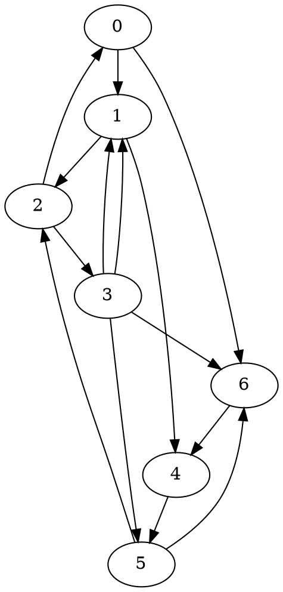
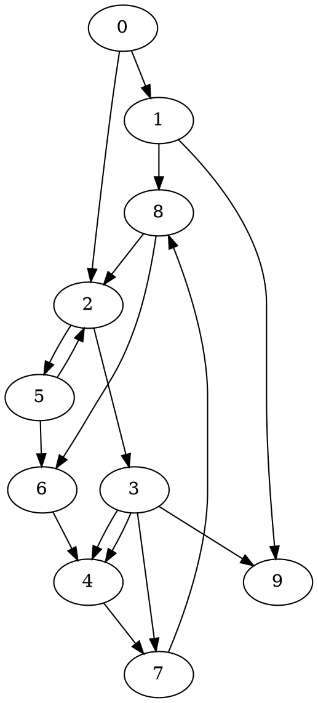
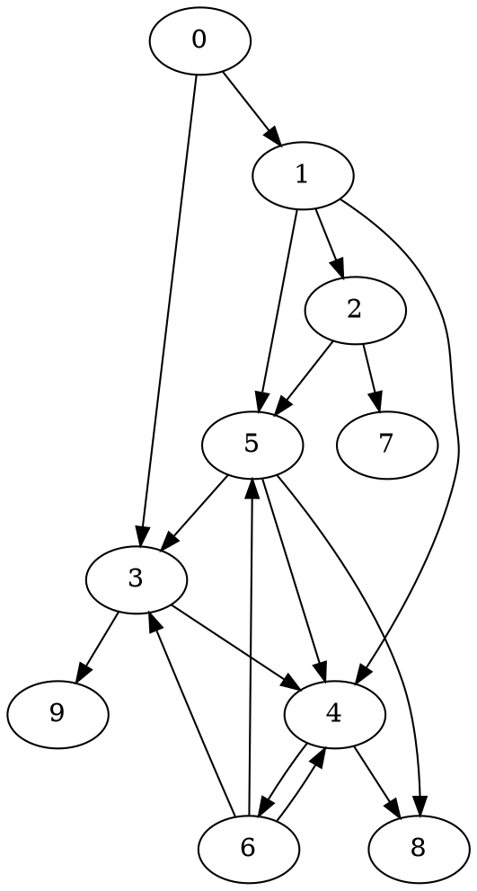

## Lengauer-Tarjan algorithm

<!-- more -->

A path $P=(u=v_0,v_1,\ldots,v_{k-1},v_k=v)$ in _G_ is a semidominator path if $v_i>v$ for $1\leq i<k$.
The semidominator of vertex _v_ is defined as:

$$sdom(v) = \text{min}\{u | \text{there is a sdom path from } u \text{ to } v\}$$

We compute `sdom[*]` using the reverse pre-order to utilize already-computed `sdom[*]` of larger indices.
For each vertex `v`, enumerate its predecessor `u`, and the minimum pre-order number in the ancestor path of `u` provides a candidate `sdom[v]`.
The following implementation employs a trick by merging `parent[]` into `uf[]`.

With a simple implementation of eval-link, the time complexity is $O(E\log V)$.

```cpp
#include <algorithm>
#include <cstdio>
using namespace std;

const int N = 100000, M = 500000;
struct Arc { int v, next; } pool[2*M+N], *pit;
int e[N], ee[N], domch[N], tick, dfn[N], rdfn[N], uf[N], sdom[N], best[N], idom[N];

void dfs(int u) {
  dfn[u] = tick;
  rdfn[tick++] = u;
  for (int v, a = e[u]; ~a; a = pool[a].next)
    if (dfn[v = pool[a].v] < 0) {
      uf[v] = u;
      dfs(v);
    }
}

int eval(int v, int cur) {
  if (dfn[v] <= cur)
    return v;
  int u = uf[v], r = eval(u, cur);
  if (dfn[sdom[best[u]]] < dfn[sdom[best[v]]])
    best[v] = best[u];
  return uf[v] = r;
}

void simpleLengauerTarjan(int n, int r) {
  fill_n(dfn, n, -1);
  tick = 0;
  dfs(r);
  for (int i = 0; i < n; i++)
    sdom[i] = best[i] = i;
  for (int i = tick; --i; ) {
    int v = rdfn[i], u;
    for (int a = ee[v]; ~a; a = pool[a].next)
      if (dfn[u = pool[a].v] != -1) {
        eval(u, i);
        if (dfn[sdom[best[u]]] < dfn[sdom[v]])
          sdom[v] = sdom[best[u]];
      }
    *pit = {v, domch[sdom[v]]};
    domch[sdom[v]] = pit++-pool;
    v = rdfn[i-1];
    for (int a = domch[v]; ~a; a = pool[a].next) {
      u = pool[a].v;
      eval(u, i-1);
      idom[u] = sdom[best[u]] == v ? v : best[u];
    }
  }
  for (int i = 1; i < tick; i++) {
    int v = rdfn[i];
    if (idom[v] != sdom[v])
      idom[v] = idom[idom[v]];
  }
}

int main() {
  int n, m;
  scanf("%d%d", &n, &m);
  pit = pool;
  fill_n(e, n, -1);
  fill_n(ee, n, -1);
  fill_n(domch, n, -1);
  for (int i = 0; i < m; i++) {
    int u, v;
    scanf("%d%d", &u, &v);
    *pit = {v, e[u]};
    e[u] = pit++-pool;
    *pit = {u, ee[v]};
    ee[v] = pit++-pool;
  }
  simpleLengauerTarjan(n, 0);

  for (int i = 0; i < n; i++)
    printf("%d: %d\n", i, idom[i]);
}
```

With a sophisticated method balancing union-find trees, the time complexity can be improved to $O(E\alpha(E,V))$.

## Semi-NCA algorithm

Loukas Georgiadis proposed the Semi-NCA algorithm in _Linear-Time Algorithms for Dominators and Related Problems_.
It has a time complexity of $O(V^2)$, but faster than the almost linear Lengauer-Tarjan's algorithm in practice.

For each vertex `v` that is not the source, `idom(v)` is the lowest common ancestor of `sdom(v)` and `parent(v)`.
For each vertex `v` in the pre-order except the source, ascend the ancestor path of `v` and find the deepest vertex whose pre-order number is less than or equal to `sdom(v)`'s number.

```cpp
#include <algorithm>
#include <cstdio>
#include <numeric>
using namespace std;

const int N = 100000, M = 500000;
struct Arc { int v, next; } pool[2*M], *pit;
int e[N], ee[N], tick, dfn[N], rdfn[N], uf[N], sdom[N], best[N], idom[N];

void dfs(int u) {
  dfn[u] = tick;
  rdfn[tick++] = u;
  for (int v, a = e[u]; ~a; a = pool[a].next)
    if (dfn[v = pool[a].v] < 0) {
      uf[v] = u;
      dfs(v);
    }
}

int eval(int v, int cur) {
  if (dfn[v] <= cur)
    return v;
  int u = uf[v], r = eval(u, cur);
  if (dfn[best[u]] < dfn[best[v]])
    best[v] = best[u];
  return uf[v] = r;
}

void semiNca(int n, int r) {
  fill_n(idom, n, -1); // delete if unreachable nodes are not needed
  fill_n(dfn, n, -1);
  tick = 0;
  dfs(r);
  iota(best, best+n, 0);
  for (int i = tick; --i; ) {
    int v = rdfn[i], u;
    sdom[v] = v;
    for (int a = ee[v]; ~a; a = pool[a].next)
      if (~dfn[u = pool[a].v]) {
        eval(u, i);
        if (dfn[best[u]] < dfn[sdom[v]])
          sdom[v] = best[u];
      }
    best[v] = sdom[v];
    idom[v] = uf[v];
  }
  for (int i = 1; i < tick; i++) {
    int v = rdfn[i];
    while (dfn[idom[v]] > dfn[sdom[v]])
      idom[v] = idom[idom[v]];
  }
}

int main() {
  int n, m;
  scanf("%d%d", &n, &m);
  pit = pool;
  fill_n(e, n, -1);
  fill_n(ee, n, -1);
  for (int i = 0; i < m; i++) {
    int u, v;
    scanf("%d%d", &u, &v);
    *pit = {v, e[u]};
    e[u] = pit++-pool;
    *pit = {u, ee[v]};
    ee[v] = pit++-pool;
  }
  semiNca(n, 0);

  for (int i = 0; i < n; i++)
    printf("%d: %d\n", i, idom[i]);
}
```

## Testdata

The following tests helped me diagnose bugs in my semi-NCA implementation.







## Iterative DFS

```cpp
#include <cstdio>
#include <iostream>
#include <type_traits>
#include <vector>
using namespace std;

#define FOR(i, a, b) for (remove_cv<remove_reference<decltype(b)>::type>::type i = (a); i < (b); i++)
#define REP(i, n) FOR(i, 0, n)

struct arc { int v, c; };
vector<vector<arc>> e, ee;
vector<int> seq, pre, post, idom;
int dfn;

void dfs(int u) {
  pre[u] = dfn++;
  for (arc a: e[u])
    if (idom[a.v] == -1) {
      idom[a.v] = u;
      dfs(a.v);
    }
  seq.push_back(u);
  post[u] = dfn;
}

void idfs(int n, int r) {
  bool changed;
  pre.resize(n);
  post.resize(n);
  seq.clear();
  idom.assign(n, -1);
  idom[r] = -2;
  dfn = 0;
  dfs(r);
  do {
    changed = false;
    for (int i = seq.size() - 2; i >= 0; i--) {
      int v = seq[i], x = -1;
      for (arc &a: ee[v]) {
        if (x == -1)
          x = a.v;
        else {
          int y = a.v;
          while (x != y) {
            if (pre[x] > pre[y])
              x = idom[x];
            else
              y = idom[y];
          }
        }
      }
      if (x != idom[v]) {
        idom[v] = x;
        changed = true;
      }
    }
  } while (changed);
}

int main() {
  int n, i, j, c;
  cin >> n;
  e.resize(n);
  ee.resize(n);
  while (cin >> i >> j) {
    e[i].push_back(arc{j});
    ee[j].push_back(arc{i});
  }

  idfs(n, 0);
  REP(i, n)
    printf("%d: %d\n", i, idom[i]);
}
```

## Dynamic dominators

### Depth Based Search

After insertion of (x,y), v is affected iff
depth(nca)+1 < depth(v) && exists path P from y to v s.t depth(v) <= depth(w)
and d(v) is changed to nca

## Natural loops

See [natural loops](/blog/2025-01-20-natural-loops).
